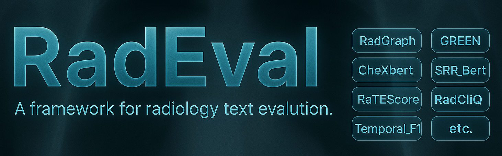

<div align="center">
  <a href="https://github.com/jbdel/RadEval">
    
  </a>
</div>

<div align="center">

***🩺 All-in-one metrics for evaluating AI-generated radiology text 📊***

</div>

<!--- BADGES: START --->
[]()
[]()
[]()
<!--- BADGES: END --->

## 📖 Table of Contents

- [🌟 Overview](#-overview)
- [✨ Key Features](#-key-features)
- [📊 Evaluation Metrics](#-evaluation-metrics)
- [⚙️ Installation](#️-installation)
- [🚀 Quick Start](#-quick-start)
- [📁 File Format Suggestion](#-file-format-suggestion)
- [🔧 Configuration Options](#-configuration-options)
- [📈 Example Results](#-example-results)
- [🚄 Performance Tips](#-performance-tips)
- [📚 Citation](#-citation)

## 🌟 Overview

**RadEval** is a comprehensive evaluation framework specifically designed for assessing the quality of AI-generated radiology text. It provides a unified interface to multiple state-of-the-art evaluation metrics, enabling researchers and practitioners to thoroughly evaluate their radiology text generation models.

### Why RadEval?
> [!NOTE]
> - 🎯 **Domain-Specific**: Tailored for radiology text evaluation with medical knowledge integration
> - 🔄 **Multi-Metric**: Supports 11+ different evaluation metrics in one framework
> - 🚀 **Easy to Use**: Simple API with flexible configuration options
> - 📊 **Comprehensive**: From traditional n-gram metrics to advanced LLM-based evaluations
> - 🔬 **Research-Ready**: Built for reproducible evaluation in medical AI research

## ✨ Key Features
> [!TIP]
> - **Multiple Evaluation Perspectives**: Lexical, semantic, clinical, and temporal evaluations
> - **Batch Processing**: Efficient evaluation of large datasets
> - **Flexible Configuration**: Enable/disable specific metrics based on your needs
> - **Detailed Results**: Comprehensive output with metric explanations
> - **File Format Support**: Direct evaluation from common file formats (.tok, .txt, .json)

## 📊 Evaluation Metrics

RadEval currently supports the following evaluation metrics:

| Category | Metric | Description | Best For |
|----------|--------|-------------|----------|
| **Lexical** | BLEU | N-gram overlap measurement | Surface-level similarity |
| | ROUGE | Recall-oriented evaluation | Content coverage |
| **Semantic** | BERTScore | BERT-based semantic similarity | Semantic meaning preservation |
| | RadEval BERTScore | Domain-adapted ModernBertModel evaluation | Medical text semantics |
| **Clinical** | CheXbert | Clinical finding classification | Medical accuracy |
| | RadGraph | Knowledge graph-based evaluation | Clinical relationship accuracy |
| | RaTEScore |  Entity-level assessments | Medical synonyms |
| **Specialized** | RadCLIQ | Composite multiple metrics | Clinical relevance |
| | SRR-BERT | Structured report evaluation | Report structure quality |
| | Temporal F1  | Time-sensitive evaluation | Temporal consistency |
| | GREEN | LLM-based metric | Overall radiology report quality |


## ⚙️ Installation
RadEval supports Python **3.10+** and can be installed via PyPI or from source.

### Option 1: Install via PyPI (Recommended)

```bash
pip install radeval
```
> [!TIP]
> We recommend using a virtual environment to avoid dependency conflicts, especially since some metrics require loading large inference models.

### Option 2: Install from GitHub (Latest Development Version)
Install the most up-to-date version directly from GitHub:
```bash
pip install git+https://github.com/jbdel/RadEval.git
```
> This is useful if you want the latest features or bug fixes before the next PyPI release.

### Option 3: Install in Development Mode (Recommended for Contributors)
```bash
# Clone the repository
git clone https://github.com/jbdel/RadEval.git
cd RadEval

# Create and activate a conda environment
conda create -n radeval python=3.10 -y
conda activate radeval

# Install in development (editable) mode
pip install -e .
```
> This setup allows you to modify the source code and reflect changes immediately without reinstallation.

## 🚀 Quick Start

### Example 1: Basic Evaluation
Evaluate a few reports using selected metrics:
```python
from RadEval import RadEval
import json

refs = [
    "No definite acute cardiopulmonary process.Enlarged cardiac silhouette could be accentuated by patient's positioning.",
    "Increased mild pulmonary edema and left basal atelectasis.",
]
hyps = [
    "Relatively lower lung volumes with no focal airspace consolidation appreciated.",
    "No pleural effusions or pneumothoraces.",
]

evaluator = RadEval(
    do_radgraph=True,
    do_bleu=True
)

results = evaluator(refs=refs, hyps=hyps)
print(json.dumps(results, indent=2))
```
<details>
<summary> Output </summary>

```json
{
  "radgraph_simple": 0.5,
  "radgraph_partial": 0.5,
  "radgraph_complete": 0.5,
  "bleu": 0.5852363407461811
}
```

</details>

### Example 2: Comprehensive Evaluation
Set `do_details=True` to enable per-metric detailed outputs, including entity-level comparisons and score-specific breakdowns when supported.

```python
from RadEval import RadEval
import json

evaluator = RadEval(
    do_srr_bert=True,
    do_rouge=True,
    do_details=True
)

refs = [
    "No definite acute cardiopulmonary process.Enlarged cardiac silhouette could be accentuated by patient's positioning.",
    "Increased mild pulmonary edema and left basal atelectasis.",
]
hyps = [
    "Relatively lower lung volumes with no focal airspace consolidation appreciated.",
    "No pleural effusions or pneumothoraces.",
]

results = evaluator(refs=refs, hyps=hyps)
print(json.dumps(results, indent=2))
```

<details>
<summary> Output </summary>

```json
{
  "rouge": {
    "rouge1": {
      "mean_score": 0.04,
      "sample_scores": [
        0.08,
        0.0
      ]
    },
    "rouge2": {
      "mean_score": 0.0,
      "sample_scores": [
        0.0,
        0.0
      ]
    },
    "rougeL": {
      "mean_score": 0.04,
      "sample_scores": [
        0.08,
        0.0
      ]
    }
  },
  "srr_bert": {
    "srr_bert_weighted_f1": 0.16666666666666666,
    "srr_bert_weighted_precision": 0.125,
    "srr_bert_weighted_recall": 0.25,
    "label_scores": {
      "Edema (Present)": {
        "f1-score": 0.0,
        "precision": 0.0,
        "recall": 0.0,
        "support": 1.0
      },
      "Atelectasis (Present)": {
        "f1-score": 0.0,
        "precision": 0.0,
        "recall": 0.0,
        "support": 1.0
      },
      "Cardiomegaly (Uncertain)": {
        "f1-score": 0.0,
        "precision": 0.0,
        "recall": 0.0,
        "support": 1.0
      },
      "No Finding": {
        "f1-score": 0.6666666666666666,
        "precision": 0.5,
        "recall": 1.0,
        "support": 1.0
      }
    }
  }
}
```

</details>

### Example 3: File-based Evaluation
Recommended for batch evaluation of large sets of generated reports.
```python
import json
from RadEval import RadEval

def evaluate_from_files():
    def read_reports(filepath):
        with open(filepath, 'r') as f:
            return [line.strip() for line in f if line.strip()]
    
    refs = read_reports('ground_truth.tok')
    hyps = read_reports('model_predictions.tok')
    
    evaluator = RadEval(
        do_radgraph=True,
        do_bleu=True,
        do_bertscore=True,
        do_chexbert=True
    )
    
    results = evaluator(refs=refs, hyps=hyps)
    
    with open('evaluation_results.json', 'w') as f:
        json.dump(results, f, indent=2)

    return results
```

## 📁 File Format Suggestion

To ensure efficient evaluation, we recommend formatting your data in one of the following ways:

### 📄 Text Files (.tok, .txt)
Each line contains one report
```
No acute cardiopulmonary process.
Mild cardiomegaly noted.
Normal chest radiograph.
```
Use two separate files:
> - ground_truth.tok — reference reports
> - model_predictions.tok — generated reports

### 🧾 JSON Files
```json
{
  "references": [
    "No acute cardiopulmonary process.",
    "Mild cardiomegaly noted."
  ],
  "hypotheses": [
    "Normal chest X-ray.",
    "Enlarged heart observed."
  ]
}
```

### 🐍 Python Lists
```python
refs = ["Report 1", "Report 2"]
hyps = ["Generated 1", "Generated 2"]
```
> [!TIP]
> File-based input is recommended for batch evaluation and reproducibility in research workflows.

## 🔧 Configuration Options

### RadEval Constructor Parameters

| Parameter | Type | Default | Description |
|-----------|------|---------|-------------|
| `do_radgraph` | bool | False | Enable RadGraph evaluation |
| `do_green` | bool | False | Enable GREEN metric |
| `do_bleu` | bool | False | Enable BLEU evaluation |
| `do_rouge` | bool | False | Enable ROUGE metrics |
| `do_bertscore` | bool | False | Enable BERTScore |
| `do_srr_bert` | bool | False | Enable SRR-BERT |
| `do_chexbert` | bool | False | Enable CheXbert classification |
| `do_temporal` | bool | False | Enable temporal evaluation |
| `do_ratescore` | bool | False | Enable RateScore |
| `do_radcliq` | bool | False | Enable RadCLIQ |
| `do_radeval_bertsore` | bool | False | Enable RadEval BERTScore |
| `do_details` | bool | False | Include detailed metrics |

### Example Configurations

```python
# Lightweight evaluation (fast)
light_evaluator = RadEval(
    do_bleu=True,
    do_rouge=True
)

# Medical focus (clinical accuracy)
medical_evaluator = RadEval(
    do_radgraph=True,
    do_chexbert=True,
    do_green=True
)

# Comprehensive evaluation (all metrics)
full_evaluator = RadEval(
    do_radgraph=True,
    do_green=True,
    do_bleu=True,
    do_rouge=True,
    do_bertscore=True,
    do_srr_bert=True,
    do_chexbert=True,
    do_temporal=True,
    do_ratescore=True,
    do_radcliq=True,
    do_radeval_bertsore=True,
    do_details=False           # Optional: return detailed metric breakdowns
)
```

## 📈 Example Results

### Sample Output Structure
```python
from RadEval import RadEval
import json

def main():
    refs = [
        "No acute cardiopulmonary process.",
        "No radiographic findings to suggest pneumonia.",
        "1.Status post median sternotomy for CABG with stable cardiac enlargement and calcification of the aorta consistent with atherosclerosis.Relatively lower lung volumes with no focal airspace consolidation appreciated.Crowding of the pulmonary vasculature with possible minimal perihilar edema, but no overt pulmonary edema.No pleural effusions or pneumothoraces.",
        "1. Left PICC tip appears to terminate in the distal left brachiocephalic vein.2. Mild pulmonary vascular congestion.3. Interval improvement in aeration of the lung bases with residual streaky opacity likely reflective of atelectasis.Interval resolution of the left pleural effusion.",
        "No definite acute cardiopulmonary process.Enlarged cardiac silhouette could be accentuated by patient's positioning.",
        "Increased mild pulmonary edema and left basal atelectasis.",
    ]

    hyps = [
        "No acute cardiopulmonary process.",
        "No radiographic findings to suggest pneumonia.",
        "Status post median sternotomy for CABG with stable cardiac enlargement and calcification of the aorta consistent with atherosclerosis.",
        "Relatively lower lung volumes with no focal airspace consolidation appreciated.",
        "Crowding of the pulmonary vasculature with possible minimal perihilar edema, but no overt pulmonary edema.",
        "No pleural effusions or pneumothoraces.",
    ]

    # Comprehensive evaluation with all metrics
    evaluator = RadEval(
        do_radgraph=True,
        do_green=True,
        do_bleu=True,
        do_rouge=True,
        do_bertscore=True,
        do_srr_bert=True,
        do_chexbert=True,
        do_temporal=True,
        do_ratescore=True,
        do_radcliq=True,
        do_radeval_bertsore=True,
        do_details=False
    )

    results = evaluator(refs=refs, hyps=hyps)
    print(json.dumps(results, indent=4))

if __name__ == '__main__':
    main()
```

**Expected Output:**
```json
{
    "radgraph_simple": 0.41111111111111115,
    "radgraph_partial": 0.41111111111111115,
    "radgraph_complete": 0.41414141414141414,
    "bleu": 0.16681006823938177,
    "bertscore": 0.63274747133255,
    "green": 0.39999999999999997,
    "rouge1": 0.44681719607092746,
    "rouge2": 0.4205128205128205,
    "rougeL": 0.44681719607092746,
    "srr_bert_weighted_f1": 0.2857142857142857,
    "srr_bert_weighted_precision": 0.2857142857142857,
    "srr_bert_weighted_recall": 0.2857142857142857,
    "chexbert-5_micro avg_f1-score": 0.2857142857142857,
    "chexbert-all_micro avg_f1-score": 0.3333333333333333,
    "chexbert-5_macro avg_f1-score": 0.13333333333333333,
    "chexbert-all_macro avg_f1-score": 0.08333333333333333,
    "chexbert-5_weighted_f1": 0.2222222222222222,
    "chexbert-all_weighted_f1": 0.22916666666666666,
    "ratescore": 0.5877872315410949,
    "radcliq-v1": 1.6447780902700346,
    "temporal_f1": 0.500000000075,
    "radeval_bertsore": 0.4910106658935547
}
```

## 🚄 Performance Tips

**Start Small**: Test with a few examples before full evaluation
**Select Metrics**: Only enable metrics you actually need
**Batch Processing**: Process large datasets in smaller chunks
**GPU Usage**: Ensure CUDA is available for faster computation


## 📚 Citation

If you use RadEval in your research, please cite:

```BibTeX
coming soon
```

## 🙏 Acknowledgments

This project would not be possible without the foundational work of the medical AI community.  
We extend our gratitude to the authors and maintainers of the following open-source projects and metrics:

- 🧠 **CheXbert**, **RadGraph**, and **CheXpert** from Stanford AIMI for their powerful labelers and benchmarks.
- 📐 **BERTScore** and **BLEU/ROUGE** for general-purpose NLP evaluation.
- 🏥 **RadCliQ** and **RaTE Score** for clinically grounded evaluation of radiology reports.
- 🧪 **SRR-BERT** for structured report understanding in radiology.
- 🔍 Researchers contributing to temporal and factual consistency metrics in medical imaging.

Special thanks to:
- All contributors to open datasets such as **MIMIC-CXR**, which make reproducible research possible.
- Our collaborators for their support and inspiration throughout development.

We aim to build on these contributions and promote accessible, fair, and robust evaluation of AI-generated radiology text.

---

<div align="center">
  <p>⭐ If you find RadEval useful, please give us a star! ⭐</p>
  <p>Made with ❤️ for the medical AI research community</p>
</div>